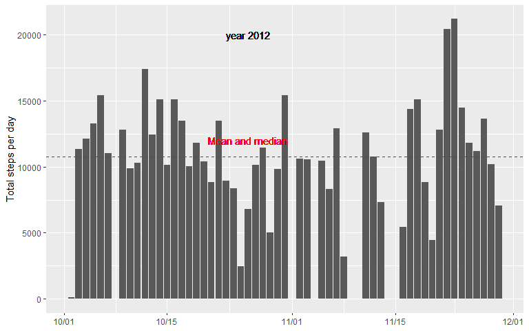
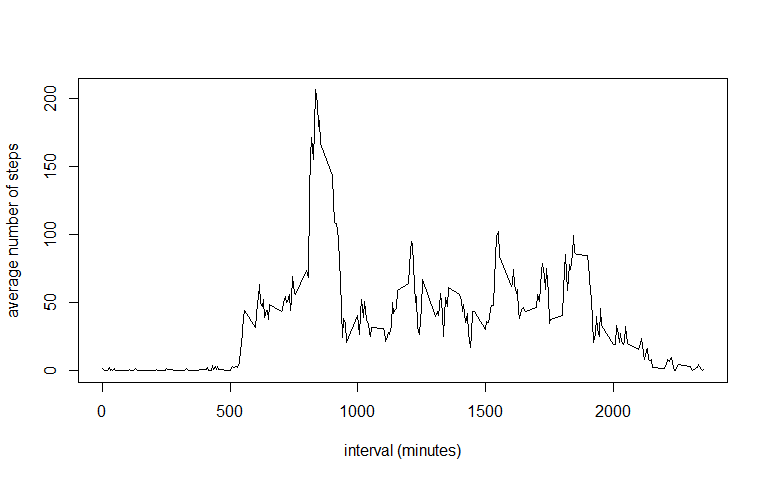
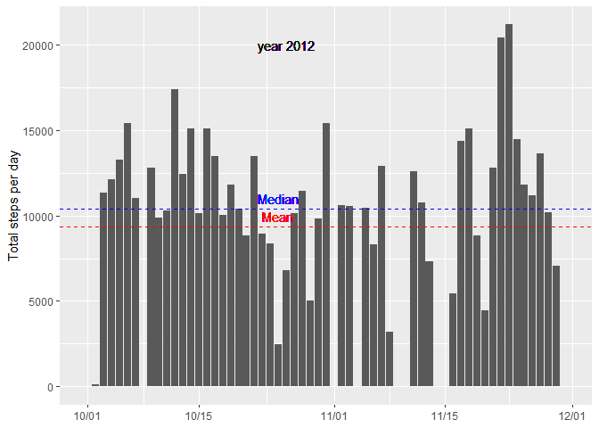
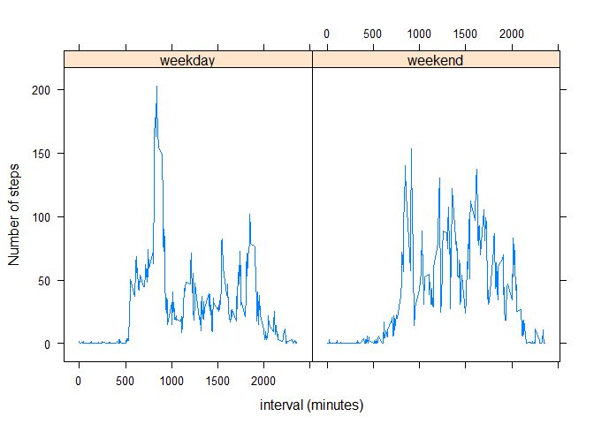

In this project we make use of data from a personal activity monitoring device. This device collects data at 5 minute intervals through out the day. The data consists of two months of data from an anonymous individual collected during the months of October and November, 2012 and include the number of steps taken in 5 minute intervals each day.

## Loading and preprocessing the data

We begin by unzipping and reading the csv file. We also remove the missing values by using the *complete.cases* command.


```r
## Loading and preprocessing the data
unzip("activity.zip")
myfile <- read.csv("activity.csv") # the original dataset

## We ignore and remove the "NA" values (we update the dataset name)
data <- myfile[complete.cases(myfile[,1]),]
```


## What is mean total number of steps taken per day?

We are next going to evaluate the total number of steps taken per day from the data frame "data". To do so we use the function *tapply* with the command *with* as shown in the next code.


```r
## We calculate the total number of steps taken per day:
total.steps <- with(data, tapply(data$steps, data$date,sum, na.rm = TRUE))

## We create the data frame that we have to plot:
total <- data.frame(steps = total.steps, date = factor(unique(data$date)))

## We calculate the mean and the median of total steps
stmean <- mean(total$steps)
stmedian <- median(total$steps)

## We plot the histogram with the total number of steps per day:
library(ggplot2)
ggplot(total, aes(x=as.Date(date), y=steps)) + geom_bar(stat="identity")+
    scale_x_date(date_labels = "%m/%d")+
    geom_text(x=as.Date("2012-10-26"), y=12000, label="Mean and median", col = "red")+
    geom_text(x=as.Date("2012-10-26"), y=20000, label="year 2012", col = "black")+
    geom_hline(yintercept = c(stmean,stmedian),col = "red",linetype = 2)+
    labs(y = "Total steps per day")+
    theme(axis.title.x=element_blank())
```

<!-- -->

The histogram shows that the mean and the median are so close that cannot be distinguished in the plot. Namely, the mean and the median of the total number of steps taken per day are of **10766** and of **10765** steps, respectively.


## What is the average daily activity pattern?

We want next to know what is the moment of the day with the highest activity by averaging across the days during which the measurements have been recorded. To do so we use the command *aggregate*, which is useful when we want to group the data frame by some variable and apply a certain function to another variable (the reference variable) of the data. In our case, the next code evaluates the mean number of steps for each time interval by averaging across all the days.


```r
## We aggregate (or group by) the minute intervals the dataset and we
## evaluate the mean value across the days:
timeSeries <- aggregate(data$steps,  by=list(interval = data$interval), FUN=mean)

## We plot the requested time series:
plot(timeSeries$interval, timeSeries$x, type = "l", xlab = "interval (minutes)", ylab = "average number of steps")
```

<!-- -->

The plot shows that the highest activity occurs (in average) around the end of the first third of the collected number of intervals. The next code calculates the value of the time interval where this maximum occurs:


```r
## We calculate the minute interval where the average number of steps across
## the days is maximum:
reqInterval <- timeSeries$interval[which(timeSeries$x == max(timeSeries$x))]
```

The interval of the day where the average number of steps across all the days is maximum is **835**.

## Imputing missing values

In the next code a simple strategy is used to fill in all the missing values so as to create a new dataset ("newfile") with no missing values. We replace the missing values ("NA") by zeroes so we do not add any artificial step.


```r
## We calculate the total number of missing values in the original dataset:
missing <- is.na(myfile[,1])

missingTotal <- sum(missing)

## We fill in the missing values with 0, so we avoid to add artificial values
## to the total number of steps per day (even though the average values will vary).
newfile <- myfile # we clone the original dataset
newfile[missing,1] <- 0 # we replace "NA" by 0.
```

The total number of missing values that the code yields is **2304**.

The following code plots the histogram with the total number of steps per day of the new dataset with no missing values.


```r
## We calculate the total number of steps taken per day:
new.total.steps <- with(newfile, tapply(newfile$steps, newfile$date,sum))

## We create the data frame that we have to plot:
new.total <- data.frame(steps = new.total.steps, date = factor(unique(newfile$date)))

## We calculate the mean and the median of total steps
newstmean <- mean(new.total$steps)
newstmedian <- median(new.total$steps)

## We plot the histogram with the total number of steps per day:
library(ggplot2)
ggplot(new.total, aes(x=as.Date(date), y=steps)) + geom_bar(stat="identity")+
    scale_x_date(date_labels = "%m/%d")+
    geom_text(x=as.Date("2012-10-25"), y=10000, label="Mean", col = "red")+
    geom_text(x=as.Date("2012-10-25"), y=11000, label="Median", col = "blue")+
geom_text(x=as.Date("2012-10-26"),  y=20000, label="year 2012", col = "black")+
    geom_hline(yintercept = newstmean,col = "red",linetype = 2)+
    geom_hline(yintercept = newstmedian,col = "blue",linetype = 2)+
    labs(y = "Total steps per day")+
    theme(axis.title.x=element_blank())
```

<!-- -->

Note the differences between the histogram of the new dataset with respect to the original one. The mean and median of the total number of steps taken per day of the new dataset without missing values are **9354** and **10395** steps, respectively. **The results change noticeably!**

## Are there differences in activity patterns between weekdays and weekends?

In this section we check whether there is a different activity pattern between the weekdays and the weekends.

In the next code the library *lubridate* is loaded so we can work with dates. The local time system variable is modified so as to use the Coursera common language (English) for the definition of the days of the week.


```r
## We load the lubridate library to deal with dates:
library(lubridate)
```

```
## 
## Attaching package: 'lubridate'
```

```
## The following objects are masked from 'package:base':
## 
##     date, intersect, setdiff, union
```

```r
## We use the "coursera" common language system:
Sys.setlocale("LC_TIME", "English")
```

The next code creates a new factor named *newfactor* that accounts for the day of the week corresponding to the date of the original data frame, either "weekday" or "weekend". The code binds the new factor to the created data frame "newfile" where no missing values exist.


```r
## We create an intermediate variable in order to lighten the for loop:
newdate <- as.Date(newfile$date)

newfactor <- factor(c("weekday","weekend")) # we create the newfactor variable

## We assign the value weekend or week to each row of "newfactor":
for (i in 1:length(newfile$date)){
    if (weekdays(newdate[i]) == "Saturday" | weekdays(newdate[i]) == "Sunday"){
        newfactor[i] <- "weekend"
    }
    
    else{
        newfactor[i] <- "weekday"
    }

}

## We bind "newfactor" as a new column of the data frame "newfile":
newfile <- cbind(newfile,newfactor)
```

Finally, we aggregate the data by *newfactor* and by time interval so as to evaluate the mean value of steps averaged across all the days.


```r
## We aggregate the data (group the data) by the minute intervals of the dataset
## together with the newfactor accounting for the day of the week and we evaluate
## evaluate the mean value across the days (the remaining variable of "newfile"):
output <- aggregate(newfile$steps,  by=list(interval = newfile$interval, newfactor = newfile$newfactor), FUN=mean)

library(lattice)
## We plot the time series for the weekday and the weekend case separately:
xyplot(x ~ interval | newfactor, data = output, type = "l", xlab = "interval (minutes)", ylab = "Number of steps")
```

<!-- -->

The figure above shows that the maximum activity occurs around the same interval for both groups, weekday or weekend, but the peak during the week is higher than on weekends.
